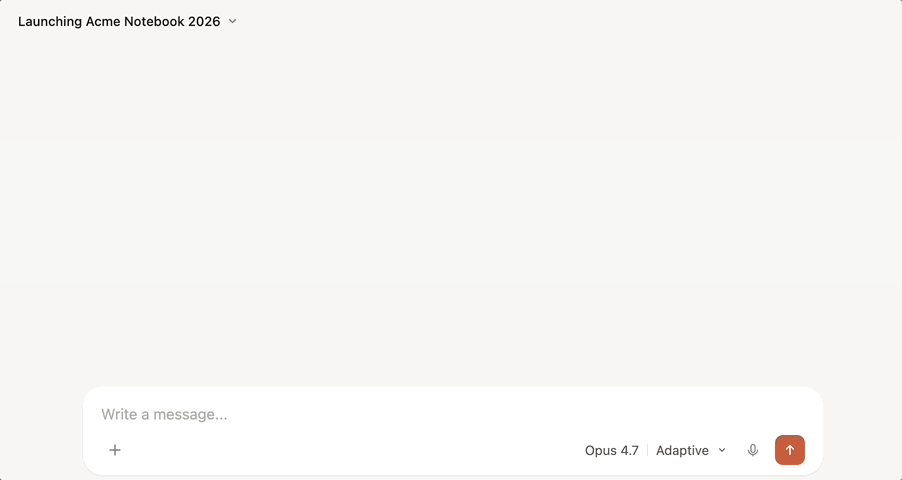
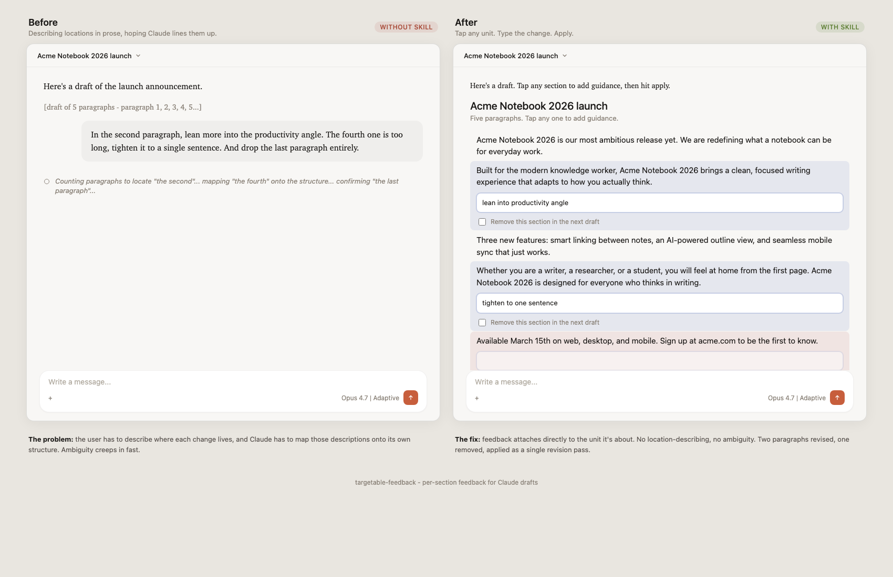

# targetable feedback (Claude skill)

Iterate on a Claude draft section-by-section instead of writing a paragraph that describes which other paragraph to change. Tap any unit, say what you want different, hit apply - the marked sections rewrite in a single revision pass and everything else comes back byte-identical.

> [!NOTE]
> The skill works best in **[claude.ai](https://claude.ai) on the web**. The Claude desktop app currently has rendering quirks where the widget can stay in a loading state after generation - usually fixed by refreshing the window. The web app is the recommended environment until those issues are resolved.

## In action

Three changes pending. One apply button. No location-describing required.

  

## Why this exists

  

Today, iterating on a multi-section draft means typing things like *"in the second paragraph - actually maybe the third, I can't remember - lean more into the productivity angle, and drop the last bullet."* Then Claude has to map your prose onto its own structure and hope it landed on the right unit. Both sides do double work and ambiguity creeps in fast.

This skill removes the location-describing step. Claude already knows the structure of what it wrote - surfacing that as an addressable widget means your guidance attaches directly to the unit it's about. No prose-mapping, no ambiguity, one revision pass.

## When it activates

The skill triggers on stated iteration intent, not on output-shape heuristics. Two paths:

**At generation time.** Ask for a draft and signal iteration in the same request.

- "Draft an RFC for the new auth system and let me give feedback on each section."
- "Write a Q3 planning doc I can iterate on section by section."

**Retroactively on prior assistant output.** After Claude returns a multi-section response, ask to mark it up.

- "Let me give feedback on each part."
- "Make that targetable."
- "I want to iterate on what you just wrote."

The skill does not fire on one-shot drafting requests, single-edit feedback like "fix bullet 3," content dominated by code or tables, or output under roughly three paragraphs.

## Install

1. Download [`targetable-feedback.zip`](https://github.com/jordanl17/claude-skill-targetable-feedback/releases/latest/download/targetable-feedback.zip) from the latest release.
2. Open [claude.ai/customize/skills](https://claude.ai/customize/skills) (or navigate via **Customize → Skills** in the left sidebar).
3. Click the **+** button, then **Create Skill** → **Upload a Skill**.
4. Select the `targetable-feedback.zip` file you downloaded.

The skill appears in your skills list once uploaded. Trigger it by asking for a draft and signaling iteration intent (see [When it activates](#when-it-activates)).

### Build from source

If you want to install from a specific commit or modify the skill locally:

1. Clone this repo.
2. From the repo root, run `./scripts/build-zip.sh` (or manually zip the `targetable-feedback/` directory).
3. The resulting `targetable-feedback.zip` can be uploaded via claude.ai as above.

The archive must contain a single `targetable-feedback/` folder at its root with `SKILL.md` and `assets/` inside.

## Limitations

- **Available in claude.ai only.** The widget renders through `visualize:show_widget`, which is not exposed in Claude Code or the Anthropic API.
- **Web preferred over desktop.** The Claude desktop app has rendering issues that can leave the widget locked in a loading state until the window is refreshed.
- **Two levels of nesting maximum.** Top-level paragraphs / bullets and one level of sub-bullets. Deeper nesting flattens into the containing sub-bullet's text - address it in guidance if needed.
- **Prose-focused.** Code blocks and tables are tolerated when incidental but disqualify activation if they dominate the content.
- **No structural edits through the widget.** Reordering, splitting, or merging units requires a prose follow-up.

## License

MIT. See [LICENSE](LICENSE).
